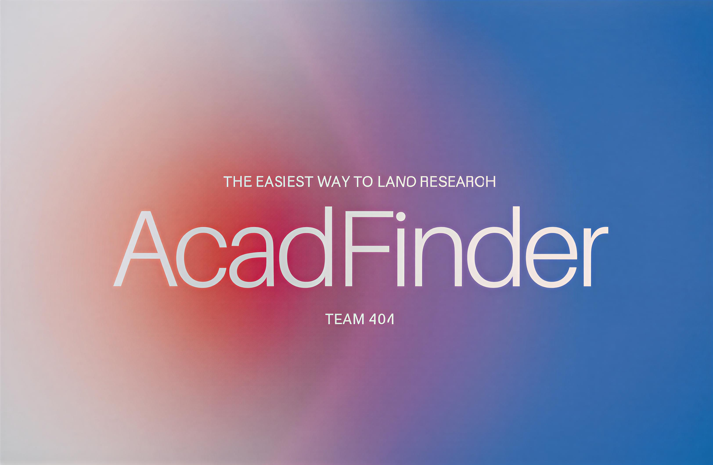

# 🎓 AcadFinder

**Simplifying the Research Journey for Students**

AcadFinder is a comprehensive platform designed to streamline the process of finding research opportunities and connecting with professors. Built during a hackathon, this full-stack application consolidates scattered resources into a single, intuitive interface.

<p align="center">

</p>

## 🌟 Inspiration

Research is one of the most valuable experiences a student can pursue. However, as undergraduate students, we found ourselves overwhelmed by:
- Inconsistent and incomplete university repositories
- Complex academic papers that were difficult to understand
- The challenge of crafting compelling emails to busy professors
- Balancing research exploration with an already demanding schedule

We created AcadFinder to be the tool we wished existed when we started our research journey a platform that simplifies the process and reignites the passion for discovery.


## ✨ Features

### 📚 Professor Directory
- **Unified Database**: Browse professors sorted by university and department
- **Quick Access**: Direct links to contact information and research profiles
- **AI-Powered Summaries**: Easy-to-read summaries of recent publications
- **Favorites System**: Save and organize professors you're interested in

### 🤖 AI Research Assistant
Powered by **Gemini API**, our intelligent assistant helps with:
- Writing professional research emails
- Preparing for professor meetings
- Choosing research areas aligned with your interests
- Answering common questions about the research process

### 🎙️ Interview Practice Tool
Powered by **ElevenLabs API**, this voice-based feature allows you to:
- Practice discussing research topics
- Prepare for informal interviews with professors
- Build confidence before reaching out
- Receive real-time conversational practice

### 📧 Email Templates
- Curated templates for various research scenarios
- Professional formatting and structure
- Customizable for different contexts


## 🛠️ Built With

- **Frontend**: React + Bootstrap
- **Backend & Database**: Supabase (Authentication, Storage, Real-time Syncing)
- **AI Integration**: Gemini API
- **Voice Technology**: ElevenLabs API
- **Languages**: JavaScript

## 🚀 Getting Started

### Prerequisites
- Node.js (v14 or higher)
- npm or yarn
- Supabase account (currenlty you need to add you own supabase data)
- Gemini API key
- ElevenLabs API key

### Installation

1. **Clone the repository**
   ```bash
   git clone https://github.com/tthy-working/frontend.git
   ```

2. **Install dependencies**
   ```bash
   npm install
   ```

3. **Set up environment variables**
   
   Create a `.env` file in the root directory:
   ```env
   VITE_SUPABASE_URL=your_supabase_url
   VITE_SUPABASE_ANON_KEY=your_supabase_anon_key
   VITE_GEMINI_API_KEY=your_gemini_api_key
   VITE_ELEVENLABS_API_KEY=your_elevenlabs_api_key
   ```

4. **Run the development server**
   ```bash
   npm run dev
   ```

5. **Open your browser**
   
   Navigate to `http://localhost:5173`


## 🏗️ Architecture

```
AcadFinder/
├── src/
│   ├── components/       # React components
│   ├── pages/           # Page components
│   ├── services/        # API integrations (Gemini, ElevenLabs)
│   ├── firebase/        # Supabase configuration
│   └── App.jsx          # Main application component
├── public/              # Static assets
└── package.json         # Dependencies
```


## 💡 How It Works

1. **Search & Discover**: Browse our curated directory of professors filtered by university and department
2. **Learn & Understand**: Read AI-generated summaries of recent research papers
3. **Prepare**: Use our AI assistant to craft emails and prepare for meetings
4. **Practice**: Engage with our voice-based interview simulator
5. **Connect**: Reach out to professors with confidence


## 🎯 Challenges We Overcame

- **Collaborative Development**: Learning to work effectively with Git and GitHub as a team
- **Task Prioritization**: Balancing dependencies and organizing work efficiently
- **Integration Complexity**: Seamlessly connecting multiple APIs and services
- **Data Curation**: Manually organizing professor information and research summaries


## 🏆 Accomplishments

- ✅ Built a polished, full-stack application exceeding our original vision
- ✅ Developed effective teamwork and collaboration skills
- ✅ Created a product we would personally use
- ✅ Successfully integrated multiple complex APIs
- ✅ Delivered a complete solution within hackathon timeframe

## 📚 What We Learned

- **Teamwork**: Progress is more satisfying and achievable when working collaboratively
- **Resilience**: We're capable of tremendous growth under pressure
- **Technical Skills**: Gained hands-on experience with modern web technologies
- **Problem Solving**: Learned to navigate challenges and adapt quickly


## 🔮 What's Next

We're committed to expanding AcadFinder's capabilities:

### Immediate Goals
- 🔄 **Automated Data Pipeline**: Scrape and organize professor data automatically
- 🌐 **University Expansion**: Add more institutions to our directory
- 📊 **Analytics Dashboard**: Track application progress and success rates
- 🔔 **Notification System**: Alert users about new research opportunities

### Long-term Vision
- Integration with academic databases (Google Scholar, PubMed)
- Mobile application for iOS and Android
- Community features for students to share experiences
- Advanced matching algorithm based on research interests


## 👥 Team

Built by De Anza Student Team 404 who believe in making research accessible to everyone.


## 🙏 Acknowledgments

- Thanks to all the professors who inspired this project
- ElevenLabs for their amazing voice API
- Google for the Gemini API
- Supabase for their excellent backend platform
- The hackathon organizers **De Anza 4.0** and mentors


